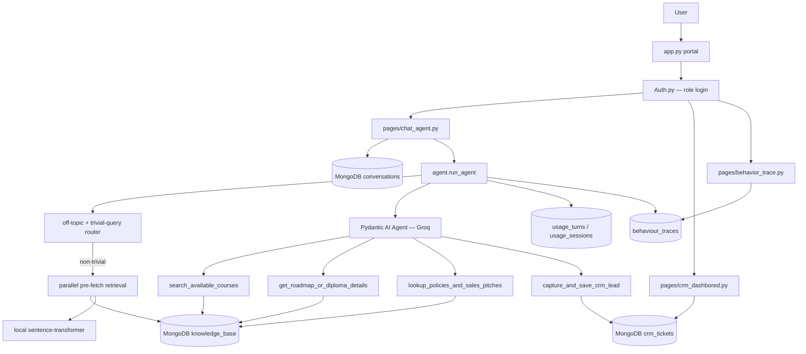

# Kayfa AI Sales Agent

**Arabic-first sales assistant and CRM capture system for Kayfa's education catalog.**
 
   
 
A Streamlit portal backed by MongoDB Atlas, local multilingual embeddings, and a [Pydantic AI](https://ai.pydantic.dev/) agent served through Groq's `openai/gpt-oss-120b`. The agent answers product, pricing, and policy questions in real time and silently captures qualified leads into a CRM 
---
## Demo 
<p align="center">
  <video src="[https://github.com/user-attachments/assets/b071b6b3-85b9-432a-90db-ed308c8e164e" 
         width="800" 
         controls>
  </video>
</p>

 
### Contents
[What it does](#what-it-does) · [Impact](#impact) · [Architecture](#architecture) · [Project structure](#project-structure) · [Tech stack](#tech-stack) · [Key design decisions](#key-design-decisions) · [Setup](#setup)
 
## What it does
 
- Chats with users about courses, tracks, diplomas, pricing, enrollment, refunds, and certificates — Arabic and English, dialect-aware.
- Retrieves grounded context from a MongoDB `knowledge_base` collection, avoiding hallucinated prices or course details.
- Lets the LLM call tools for course search, roadmap/diploma lookup, policy/pricing lookup, and silent CRM lead capture.
- Logs every conversation, CRM ticket, per-turn cost, and behavior trace to MongoDB for observability.
- Ships three role-aware Streamlit pages: chat, CRM dashboard, and admin-only behavior tracing.
---
## Impact
 
Concrete numbers from optimization work on this system, not estimates:
 
- **~45% inference cost reduction** — system prompt compressed from ~1,851 to ~558 tokens without losing pricing accuracy or tone, cutting per-turn Groq API spend nearly in half.
- **60–80% history token savings per turn** — `_build_lean_history()` strips tool payloads and pre-fetched KB context from prior turns instead of resending them every call.
- **Zero hallucinated prices** — solved via a dedicated pricing retrieval query that runs on every non-trivial turn, independent of semantic similarity to the user's phrasing.
- **Eliminated a production race condition** — concurrent Streamlit sessions were causing duplicate loads of the sentence-transformer model; a module-level singleton behind a thread lock in `semantic_search.py` fixed it.
---

## ✨ Features

- **Conversational AI Sales Agent** — warm, consultative tone in Arabic and English, dialect-aware
- **RAG Pipeline** — semantic search over a structured knowledge base (courses, roadmaps, policies, pricing)
- **CRM Lead Capture** — silently saves qualified leads (name + contact) to MongoDB with full ticket schema
- **Behaviour Tracing** — every turn logged to MongoDB with token counts, latency, tool calls, and retrieval sources
- **Usage Tracker** — per-turn and per-session cost tracking with model-specific pricing
- **Auth System** — login-gated access with role-based routing (admin vs user)
- **CRM Dashboard** — admin page showing all captured leads with filters and analytics
- **Dark Glassmorphism UI** — Kayfa gold accent, full RTL Arabic support, custom Streamlit theme

---
## Architecture
 

**A normal chat turn, end to end:**
 
1. `pages/chat_agent.py` saves the user message to MongoDB and calls `agent.run_agent(...)`.
2. Two guards run before any retrieval: `_is_off_topic()` short-circuits clearly non-Kayfa questions, and `QueryRouter.should_skip_retrieval()` skips retrieval for greetings, thanks, or contact-only messages.
3. For everything else, `_run_retrieval_parallel()` fires course, roadmap, policy, and pricing searches concurrently via `asyncio.gather()`, then injects deduplicated chunks into the prompt as pre-fetched context.
4. The Groq-hosted model runs via Pydantic AI against a **lean history** — `_build_lean_history()` strips tool payloads and pre-fetched context from prior turns, keeping only recent user/assistant text.
5. If the model calls a tool, `tools.py` hits `KnowledgeBaseDB` or `LeadDB.create_ticket()` — CRM capture only fires once both name and contact are confirmed.
6. The response is cleaned of tool-call leakage, shown in the UI, and persisted.
7. Usage and observability write asynchronously: `track_usage()` computes token/cost, `accumulate_session_usage()` rolls it into the session, and `_log_trace()` records retrieval sources, tool calls, and latency to `behaviour_traces`.
---

## Project structure
 
```
kayfa-sales-agent/
│
├── app.py                    # Streamlit entry point — routing, auth, chat UI
├── agent.py                  # Agent orchestration — retrieval, LLM call, tracing
├── tools.py                  # 4 agent tools: course search, roadmap, policies, CRM capture
├── db.py                     # MongoDB Atlas — KnowledgeBaseDB, LeadDB, vector search
├── semantic_search.py        # Sentence-transformer singleton + cosine similarity
├── prompts.py                # System prompt, language rules, pricing policy, CRM schema
├── models.py                 # Pydantic schemas — CRMLeadTicket, ConversationTurn
├── Auth.py                   # Login page, session management, role resolution
├── styles.py                 # Glassmorphism theme, RTL support, top bar, logos
├── usage_tracker.py          # Per-turn cost tracking, session accumulation
├── populate_embeddings.py    # One-time script — pre-compute embeddings for all KB docs
├── data_uploader.py          # Script — chunk and upload KB markdown/JSON to MongoDB
├── balancer_embed_test.py    # Ad-hoc script — check and backfill missing embeddings
├── pages/
│   ├── chat_agent.py          # Main chat workspace
│   ├── crm_dashbored.py       # CRM dashboard (admin only — filename typo is intentional, preserved for routing)
│   └── behavior_trace.py      # Admin-only observability replay
└── logos/                    # Kayfa brand assets
```
 
---


---

## Tech stack
 
| Layer | Technology |
|---|---|
| LLM | Groq — `openai/gpt-oss-120b` (via Pydantic AI) |
| Agent framework | Pydantic AI |
| Embeddings | `sentence-transformers/paraphrase-multilingual-MiniLM-L12-v2` (local, singleton-cached) |
| Vector search | Brute-force cosine similarity over MongoDB-stored embeddings |
| Database | MongoDB Atlas |
| Frontend | Streamlit |
| Deployment | Streamlit Cloud |
 
---
## Key design decisions
 
**Why pre-fetched context *and* tool calls?**
A two-layer retrieval strategy: context is injected before the LLM call to guarantee pricing data is always present, while tools handle targeted follow-ups. This prevents hallucination when the model doesn't proactively call the right tool.
 
**Why a lean history builder?**
Pydantic AI's default history keeps full tool payloads (KB chunks) on every turn — by turn 3 this compounds fast. `_build_lean_history()` strips tool returns and pre-fetched context, saving an estimated 60–80% of history tokens per call.
 
**Why a singleton sentence-transformer, protected by a thread lock?**
`semantic_search.py` holds one model instance behind `get_embedding_model()`, shared by `db.py` and `tools.py`. Concurrent Streamlit sessions were triggering simultaneous first-load calls, causing the model to load multiple times and racing on shared state. A module-level cache plus a thread lock ensures only one load ever happens, regardless of how many sessions hit cold start at once — a real memory and stability fix on Streamlit Cloud, not just a style preference.
 
**Why are `db` imports inside tool functions in `tools.py`?**
Resolves a circular import (`tools → db → tools`) — Python only resolves the import when the function is actually called, by which point both modules are fully initialized. A cleaner long-term fix would be splitting shared types into a third module, but this was the fast, safe fix under deadline.
 
**Why dedicated pricing retrieval instead of relying on semantic match alone?**
Enrollment-intent phrasing ("how do I sign up") doesn't always land close to a price table in embedding space. Pricing is fetched with a hardcoded query on every non-trivial turn so it's never missing when needed.
 
---
 
## Skills demonstrated
 
- **Agentic system design** — tool-calling LLM agent with guarded retrieval, not a bare chatbot wrapper.
- **Cost/latency optimization under real constraints** — measured, not assumed (see [Impact](#impact)).
- **RAG grounding** — hybrid pre-fetch + on-demand tool retrieval to prevent hallucination on pricing-critical data.
- **Production debugging** — diagnosed and fixed a live race condition and a circular import under deployment pressure.
- **Full-stack ownership** — auth, persistence, observability (behavior tracing), and a CRM dashboard, not just the model-calling layer.
---
 

## setup

### 1. Clone the repo

```bash
git clone https://github.com/yousefre14/kayfa-sales-agent.git
cd kayfa-sales-agent
```

### 2. Install dependencies

```bash
pip install -r requirements.txt
```

### 3. Configure environment variables

Create a `.env` file in the project root:

```env
GROQ_API_KEY=your_groq_api_key
MONGODB_URI=your_mongodb_atlas_connection_string
```

### 4. Upload the knowledge base

```bash
python data_uploader.py
```

### 5. Pre-compute embeddings

```bash
python populate_embeddings.py
```

### 6. Run the app

```bash
streamlit run app.py
```

---

## 📊 CRM Dashboard

Admin users see a live CRM dashboard at `/crm_dashbored` (the typo in the filename is intentional — it must be preserved for Streamlit routing). The dashboard shows:

- All captured leads with temperature classification (hot / warm / cold)
- Conversation summaries and recommended sales actions
- Filter by product interest, lead temperature, and date
- Session cost and token usage analytics

---

## 💰 Cost Tracking

Every turn tracks:

- Input tokens, output tokens
- Per-turn cost in USD (model-specific pricing table in `usage_tracker.py`)
- Session cumulative cost
- Latency in milliseconds

All data is written to the `behaviour_traces` collection in MongoDB for analysis.

